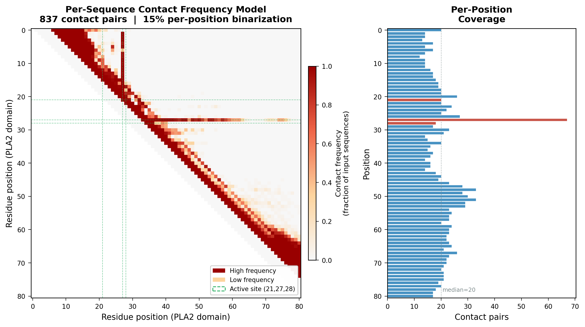
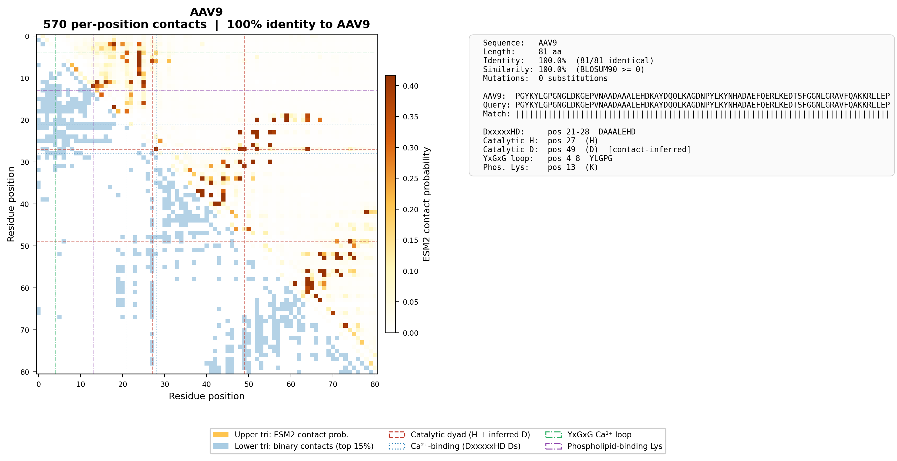
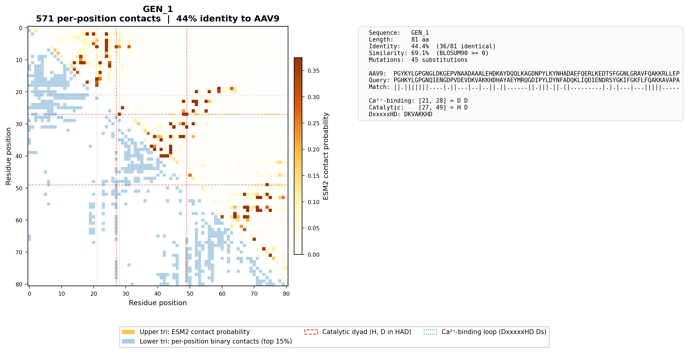
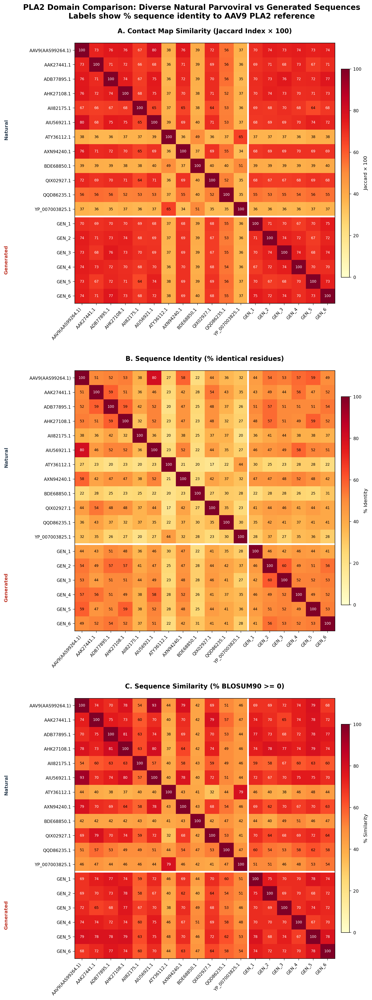

# PLA2 Domain Generator

Reimplementation of the Markov matrix-guided generative approach from [Hull et al. (2025) *JVI*](https://doi.org/10.1128/jvi.00799-25) for designing novel parvoviral phospholipase A2 (PLA2) domains, using ESM2 protein language model contact predictions in place of AlphaFold2 structural models.

> **Disclaimer:** This project is a clean-room reimplementation created as a test of [Claude's](https://www.anthropic.com/claude) (Anthropic) ability to reconstruct a computational method from its published description. The original codebase was developed in the [Asokan Lab](https://www.asokanlab.org/) and the author (J.A. Hull, first author on Hull et al. 2025) does not own rights to that software. This reimplementation is legally independent and standalone — it was built entirely from the published paper and supplemental data, not from the original source code.
>
> **Limitations:** The author notes that substituting ESM2 attention-derived contacts for AlphaFold2 structural filtering appears to be inferior, and that the original AF2-based implementation also yielded no useful candidates. The approach demonstrated functional compatibility only among very closely related PLA2 domains within the same parvoviral genera. The AlphaFold2 structural filtering context (RMSD-based candidate screening) is not reproduced here. The method may have applicability in other enzymatic domain-swapping contexts, but this is untested. This software is provided under the MIT license strictly as-is, with no guarantees of fitness for any purpose.

## Model

This reimplementation uses **ESM2-650M** ([`esm2_t33_650M_UR50D`](https://github.com/facebookresearch/esm)) as the structural proxy for contact prediction. ESM2 is a 33-layer, 650M-parameter protein language model trained on UniRef50. Residue-residue contacts are predicted using ESM2's **supervised contact prediction head** (`return_contacts=True`), which applies a trained regression over attention maps to produce L×L contact probabilities. No 3D structure prediction is performed.

The original Hull et al. (2025) method used AlphaFold2-predicted structures with a 5.0 Å Cα distance cutoff to define contacts. Here, ESM2 attention-derived scores replace that structural step entirely, making the pipeline runnable on CPU without structure prediction infrastructure.

**Note:** ESM2 is released by Meta under the [MIT license](https://github.com/facebookresearch/esm/blob/main/LICENSE). Users should verify compatibility with their use case.

## Method Overview

The pipeline generates novel PLA2 domain sequences that are diverse yet structurally compatible with the AAV9 PLA2 fold. It works in four stages:

### 1. Contact Profiling (Per-Sequence)

For each input PLA2 domain, ESM2's supervised contact prediction head produces residue-residue contact probabilities. Contacts are binarized **per-position**: each residue selects its top 15% of long-range contact partners (|i-j| ≥ 6), giving ~10-11 contacts per position. The result is symmetrized — if position i selects j, j also contacts i. Structurally important hub residues (like the catalytic histidine) naturally accumulate more contacts.

### 2. Frequency Model

Per-sequence binary contact maps are aggregated into a **contact frequency matrix**: for each pair (i,j), the fraction of input sequences where that contact appears. Amino acid pair counts are recorded **only** from sequences where the contact exists. This preserves the per-sequence nature — a contact seen in 90% of maps carries more weight than one seen in 10%.

### 3. Stochastic Sampling (Gibbs)

New sequences are generated by iterative conditional sampling from a position-specific frequency matrix (PSFM) built from all input sequences. At each position, the PSFM probability is modulated by contact compatibility with current neighbor residues, weighted by contact frequency:

- **Compatible pair** → no penalty
- **Incompatible pair at frequency f** → multiply probability by (1 - f)

This means high-frequency contacts strongly constrain sampling while rare contacts exert only mild pressure. BLOSUM90 (positive scores only) defines "wobble tolerance" — an unobserved AA pair is still accepted if both AAs are BLOSUM90-positive substitutions of some observed pair.

#### MC Enforcement Details

When resampling position `pos`, the sampler examines every contact neighbor `nb` that already has an assigned amino acid. For each of the 20 candidate AAs at `pos`:

1. **Direct observation:** Is the exact (candidate, neighbor) AA pair observed in the training contact data for this pair of positions? If yes → **compatible**, no penalty.
2. **BLOSUM90 wobble:** Is the candidate a BLOSUM90-positive substitution of *any* observed AA at `pos`, AND is the neighbor's current AA a BLOSUM90-positive substitution of *any* observed AA at `nb`? If yes → **compatible**, no penalty.
3. **Incompatible:** If neither check passes, the candidate's sampling probability is multiplied by `(1 - contact_frequency)`. A contact seen in 90% of input sequences reduces probability to 0.1×, while one seen in 20% only reduces to 0.8×. **The author notes that in the initial implimentation, this does not occur and the chain dies needing to restart.**

This is **soft enforcement** — no candidate is ever fully excluded, but structurally important contacts (high frequency) make incompatible choices exponentially unlikely through multiplicative penalties across all neighbors.

### 4. Post-Generation Verification

Generated sequences are checked for:
- Minimum weighted contact score (≥ 90%)
- DxxxxxHD catalytic motif integrity (verified, not enforced — the PSFM naturally preserves it since all inputs have the motif at 100% frequency)

## Project Structure

```
pla2_generator/
├── README.md
├── LICENSE
├── run.sh                  # One-command setup + full pipeline
├── src/                    # Source code
│   ├── generate_pla2.py    #   Shared library (BLOSUM90, ESM2, PSFM, FASTA I/O)
│   ├── import_xlsx.py      #   Import PLA2 domains from Hull et al. supplement
│   ├── run_pipeline.py     #   Main generative pipeline
│   └── make_figures.py     #   Visualization (contact maps, heatmaps)
├── data/                   # Input data
│   └── natural_pla2_domains.fasta
└── output/                 # Generated outputs
    ├── generated.fasta     #   Novel PLA2 domain sequences
    ├── contact_*.npy/npz   #   Contact model metadata
    └── figures/            #   All figures
        ├── contact_frequency_model.png
        ├── natural_*.png
        ├── generated_*.png
        ├── similarity_heatmap.png
        └── similarity_heatmap.pdf
```

## Input Data

The supplemental xlsx file (`jvi.00799-25-s0001.xlsx`) from Hull et al. (2025) is included in this repository. It contains the parental PLA2 domain sequences used as input to the generative pipeline. Place it in the project root directory before running.

## Quick Start

```bash
# Place the supplemental xlsx in the project directory, then:
chmod +x run.sh
./run.sh
```

This will:
1. Create a virtual environment and install dependencies
2. Import 779 natural PLA2 domains from the supplemental xlsx
3. Run ESM2 contact prediction on 50 diverse sequences
4. Generate 30 novel PLA2 domains via Gibbs sampling
5. Produce all figures

## Dependencies

- Python 3.9+
- PyTorch (CPU)
- [fair-esm](https://github.com/facebookresearch/esm) (ESM2-650M, MIT license)
- numpy, matplotlib, openpyxl

## Output

### Generated Sequences

`output/generated.fasta` — 30 novel PLA2 domains + AAV9 reference. Each header includes:

- `id` — percent sequence identity to AAV9
- `cs` — weighted contact score (frequency-weighted fraction of contacts satisfied)
- `pll` — pseudo-log-likelihood from the joint generative model (sum of log conditional probabilities at each position given all contact neighbors, under the PSFM × contact penalty model). Higher (less negative) = more probable under the model. The AAV9 reference PLL provides a natural baseline.

```
>AAV9_PLA2_reference|pll=-12.3
PGYKYLGPFNGLDKGE...
>generated_PLA2_001|id=0.46|cs=0.955|pll=-15.1
PGFKYLGPFNGLDKGE...
```

### Figures

#### Contact Frequency Model

Shows the per-pair contact frequency across 50 input sequences and per-position contact coverage. Each position gets ~10-11 contacts from per-position 15% binarization; hub positions (e.g., catalytic H at position 27) accumulate more via symmetrization.



#### Individual Contact Maps

For each natural and generated sequence: ESM2 continuous scores (upper triangle), per-position binary contacts (lower triangle), high-frequency model contacts (red dots), and sequence alignment with identity/similarity statistics.





#### Pairwise Comparison Heatmap

Three-panel comparison of 12 diverse natural PLA2 domains vs 6 generated sequences:
- **A.** Contact map similarity (Jaccard index)
- **B.** Sequence identity (% identical residues)
- **C.** Sequence similarity (% BLOSUM90 ≥ 0)



## Method Details

### Differences from Hull et al. (2025)

| Aspect | Hull et al. | This implementation |
|--------|------------|-------------------|
| Structure source | AlphaFold2 predicted structures | ESM2-650M (`esm2_t33_650M_UR50D`) contact prediction head |
| Contact definition | 5.0 Å Cα distance cutoff | Per-position top 15% of ESM2 contact probabilities |
| Structural filter | RMSD < 2.0 Å to AAV9 | Not reproduced (input sequences pre-filtered in supplement) |
| Input size | 484 PLA2 domains | 779 natural domains (50 for ESM2) |
| Contact model | Per-structure contacts | Per-sequence binary maps → frequency |
| Sampling | Stochastic from BLOSUM90-guided model | Gibbs sampling from PSFM + frequency-weighted contact penalties |
| BLOSUM90 role | Tolerated substitutions (log-odds > 0) | Wobble tolerance on contact pairs only |

### Key Design Choices

- **Per-position binarization** ensures even contact coverage across the domain, preventing some positions from being unconstrained
- **Contact frequency weighting** preserves the probabilistic per-sequence nature rather than collapsing to a binary consensus
- **No explicit active site locking** — the PSFM encodes 100% conservation at the calcium-binding loop (D21, D28 in DxxxxxHD), catalytic histidine (H27), and catalytic aspartate (D49 in HAD dyad), so the sampler naturally preserves them. Verified post-generation.

### Limitations

- **Catalytic Asp drift:** The catalytic aspartate (D in the HAD dyad) can shift ±2-5 residues across parvoviral genera due to small insertions/deletions. This implementation identifies it via a fixed HAD regex at position 49 (AAV9 numbering). In sequences with indels, the true catalytic D may be at a neighboring position. Per-sequence ESM2 contact maps could in principle localize it (the catalytic D should show strong contact to the catalytic H at position 27), but this contact-guided identification is not currently implemented. Position 49 is D in 83% of input sequences; positions 51 and 54 carry D in smaller subsets and may represent drifted catalytic sites.
- **ESM2 vs AlphaFold2:** ESM2 attention-derived contact probabilities appear inferior to AlphaFold2 structural contacts for this application. The original AF2-based pipeline included RMSD-based structural filtering of candidates, which is not reproduced here.
- **Genera specificity:** The original method demonstrated functional compatibility only among very closely related PLA2 domains within the same parvoviral genera.

## References

- Hull JA et al. (2025) "Functional orthogonality of phospholipase A2 domains in adeno-associated virus capsids." *Journal of Virology*. [doi:10.1128/jvi.00799-25](https://doi.org/10.1128/jvi.00799-25)
- Lin Z et al. (2023) "Evolutionary-scale prediction of atomic-level protein structure with a language model." *Science*. (ESM2; this work uses `esm2_t33_650M_UR50D`)
- Henikoff S & Henikoff JG (1992) "Amino acid substitution matrices from protein blocks." *PNAS*. (BLOSUM)

## Built by

This code was written by **Claude** (Anthropic, claude-sonnet-4-20250514)
via [Cursor](https://cursor.com), prompted and directed by
[Joshua A. Hull](https://www.linkedin.com/in/ja-hull/), who wrote the original.
This repository was created as a test of AI-assisted scientific
software development in a domain the author is familiar with.
This software is not guaranteed to work, and is provided as-is, and remains
unaffiliated to the original Asokan Lab implementation.

## License

[MIT](LICENSE)
